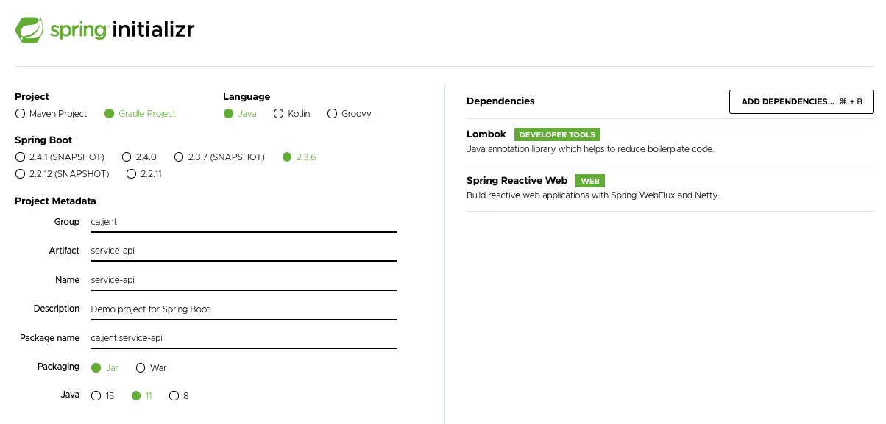
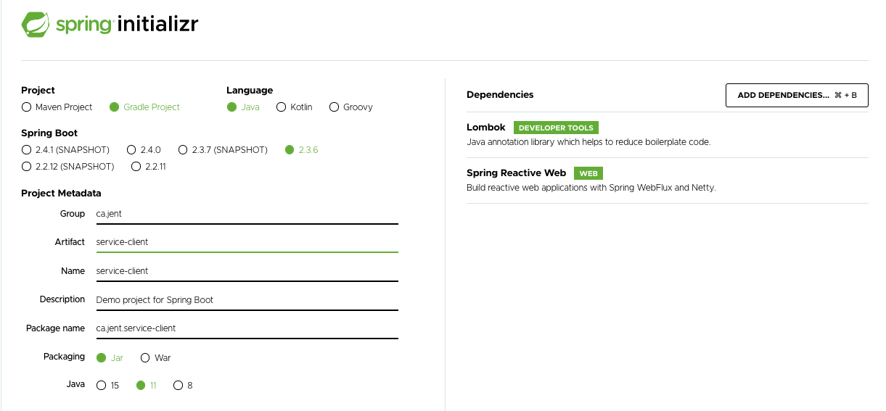

# How to create a multi-project with Gradle
Recipe showing how to create a multi-project with gradle starting with cloning a brand new GitHub project.  We will
create two sub-projects: _service-api_ and _service-client_.  This is to simulate the development of a microservice 
along with a client.  The client will be a library where other microservice can import to encapsulate the mechanics 
of calling the public REST endpoints.  But because both, the _service-api_ and _service-client_ are closely 
related and owned by the same team, they will be both part of the same GitHub repository.

## 1. Create a new GitHub Repository.

Simply use the instructions from [GitHub Docs](https://docs.github.com/en/free-pro-team@latest/github/getting-started-with-github/create-a-repo)

Note that in this particular case, I do not create a gradle project aside of the repo and copy its content once I
cloned the repo.  Instead, we will clone this repo first and then, directly within the cloned repo directory, we
will call `gradle init`.

## 2. Clone the empty GitHub Repository

```shell script
itjraymond $ git clone git@github.com:itjraymond/gradle-multi-proj-setup.git
> Cloning into 'gradle-multi-proj-setup'...
> remote: Enumerating objects: 4, done.
> remote: Counting objects: 100% (4/4), done.
> remote: Compressing objects: 100% (4/4), done.
> Receiving objects: 100% (4/4), done.
> remote: Total 4 (delta 0), reused 0 (delta 0), pack-reused 0

itjraymond $ cd gradle-multi-proj-setup/
itjraymond $ ls -la
> total 16
> drwxr-xr-x   5 jraymond  staff  160 22 Nov 11:00 .
> drwxr-xr-x  20 jraymond  staff  640 22 Nov 11:00 ..
> drwxr-xr-x  12 jraymond  staff  384 22 Nov 11:00 .git
> -rw-r--r--   1 jraymond  staff  278 22 Nov 11:00 .gitignore
> -rw-r--r--   1 jraymond  staff  131 22 Nov 11:00 README.md

```

As we can see, we currently only have the README.md file (this file :-)

## 3. Create Gradle multi-project structure.

Once we cloned the empty GitHub project and changed directory to it, we can execute a `gradle init` command.

```shell script
itjraymond $ gradle init

Select type of project to generate:
  1: basic
  2: application
  3: library
  4: Gradle plugin
Enter selection (default: basic) [1..4] 2

Select implementation language:
  1: C++
  2: Groovy
  3: Java
  4: Kotlin
  5: Scala
  6: Swift
Enter selection (default: Java) [1..6] 3

Split functionality across multiple subprojects?:
  1: no - only one application project
  2: yes - application and library projects
Enter selection (default: no - only one application project) [1..2] 2

Select build script DSL:
  1: Groovy
  2: Kotlin
Enter selection (default: Groovy) [1..2] 1

Project name (default: gradle-multi-proj-setup): gradle-multi-proj-setup
Source package (default: gradle.multi.proj.setup):

> Task :init
Get more help with your project: https://docs.gradle.org/6.7.1/samples/sample_building_java_applications_multi_project.html

BUILD SUCCESSFUL in 1m 4s
2 actionable tasks: 2 executed
jraymond@snappi gradle-multi-proj-setup $ ls -la
total 56
drwxr-xr-x  15 jraymond  staff   480 22 Nov 11:22 .
drwxr-xr-x  20 jraymond  staff   640 22 Nov 11:00 ..
drwxr-xr-x  12 jraymond  staff   384 22 Nov 11:00 .git
-rw-r--r--   1 jraymond  staff   154 22 Nov 11:22 .gitattributes
-rw-r--r--   1 jraymond  staff   382 22 Nov 11:22 .gitignore
drwxr-xr-x   7 jraymond  staff   224 22 Nov 11:22 .gradle
-rw-r--r--   1 jraymond  staff  1931 22 Nov 11:21 README.md
drwxr-xr-x   4 jraymond  staff   128 22 Nov 11:22 app
drwxr-xr-x   4 jraymond  staff   128 22 Nov 11:22 buildSrc
drwxr-xr-x   3 jraymond  staff    96 22 Nov 11:21 gradle
-rwxr-xr-x   1 jraymond  staff  5766 22 Nov 11:21 gradlew
-rw-r--r--   1 jraymond  staff  2763 22 Nov 11:21 gradlew.bat
drwxr-xr-x   4 jraymond  staff   128 22 Nov 11:22 list
-rw-r--r--   1 jraymond  staff   408 22 Nov 11:22 settings.gradle
drwxr-xr-x   4 jraymond  staff   128 22 Nov 11:22 utilities
jraymond@snappi gradle-multi-proj-setup $ tree
.
├── README.md
├── app
│   ├── build.gradle
│   └── src
│       ├── main
│       │   ├── java
│       │   │   └── gradle
│       │   │       └── multi
│       │   │           └── proj
│       │   │               └── setup
│       │   │                   └── app
│       │   │                       ├── App.java
│       │   │                       └── MessageUtils.java
│       │   └── resources
│       └── test
│           ├── java
│           │   └── gradle
│           │       └── multi
│           │           └── proj
│           │               └── setup
│           │                   └── app
│           │                       └── MessageUtilsTest.java
│           └── resources
├── buildSrc
│   ├── build.gradle
│   └── src
│       └── main
│           └── groovy
│               ├── gradle.multi.proj.setup.java-application-conventions.gradle
│               ├── gradle.multi.proj.setup.java-common-conventions.gradle
│               └── gradle.multi.proj.setup.java-library-conventions.gradle
├── gradle
│   └── wrapper
│       ├── gradle-wrapper.jar
│       └── gradle-wrapper.properties
├── gradlew
├── gradlew.bat
├── list
│   ├── build.gradle
│   └── src
│       ├── main
│       │   ├── java
│       │   │   └── gradle
│       │   │       └── multi
│       │   │           └── proj
│       │   │               └── setup
│       │   │                   └── list
│       │   │                       └── LinkedList.java
│       │   └── resources
│       └── test
│           ├── java
│           │   └── gradle
│           │       └── multi
│           │           └── proj
│           │               └── setup
│           │                   └── list
│           │                       └── LinkedListTest.java
│           └── resources
├── settings.gradle
└── utilities
    ├── build.gradle
    └── src
        ├── main
        │   ├── java
        │   │   └── gradle
        │   │       └── multi
        │   │           └── proj
        │   │               └── setup
        │   │                   └── utilities
        │   │                       ├── JoinUtils.java
        │   │                       ├── SplitUtils.java
        │   │                       └── StringUtils.java
        │   └── resources
        └── test
            └── resources

54 directories, 21 files
jraymond@snappi gradle-multi-proj-setup $
```

As we can see, default sub-projects were created.  Those default sub-projects can be replaced with what we need: _service-api_ and _service-client_.  So
we can go ahead and delete the following folders:

`/app`

`/list`

`/utilites`

And create the following empty folders:

`service-api`

`service-client`

We now have:

```shell script
itjraymond $ ls -la
total 72
drwxr-xr-x  14 jraymond  staff   448 22 Nov 11:31 .
drwxr-xr-x  20 jraymond  staff   640 22 Nov 11:00 ..
drwxr-xr-x  12 jraymond  staff   384 22 Nov 11:00 .git
-rw-r--r--   1 jraymond  staff   154 22 Nov 11:22 .gitattributes
-rw-r--r--   1 jraymond  staff   382 22 Nov 11:22 .gitignore
drwxr-xr-x   7 jraymond  staff   224 22 Nov 11:22 .gradle
-rw-r--r--   1 jraymond  staff  9126 22 Nov 11:31 README.md
drwxr-xr-x   4 jraymond  staff   128 22 Nov 11:22 buildSrc
drwxr-xr-x   3 jraymond  staff    96 22 Nov 11:21 gradle
-rwxr-xr-x   1 jraymond  staff  5766 22 Nov 11:21 gradlew
-rw-r--r--   1 jraymond  staff  2763 22 Nov 11:21 gradlew.bat
drwxr-xr-x   2 jraymond  staff    64 22 Nov 11:31 service-api
drwxr-xr-x   2 jraymond  staff    64 22 Nov 11:31 service-client
-rw-r--r--   1 jraymond  staff   408 22 Nov 11:22 settings.gradle

itjraymond $ tree
.
├── README.md
├── buildSrc
│   ├── build.gradle
│   └── src
│       └── main
│           └── groovy
│               ├── gradle.multi.proj.setup.java-application-conventions.gradle
│               ├── gradle.multi.proj.setup.java-common-conventions.gradle
│               └── gradle.multi.proj.setup.java-library-conventions.gradle
├── gradle
│   └── wrapper
│       ├── gradle-wrapper.jar
│       └── gradle-wrapper.properties
├── gradlew
├── gradlew.bat
├── service-api
├── service-client
└── settings.gradle

8 directories, 10 files
```

We need to express those changes (i.e. removal of `/app`, `/list`, `/utilities` and addition of `/service-api` and `/service-client`) and 
that is done withing the `settings.gradle` file.  Before editing the `settings.gradle`, the file content should be as follow:

```shell script
itjraymond $ cat settings.gradle
> rootProject.name = 'gradle-multi-proj-setup'
> include('app', 'list', 'utilities')

itjraymond $
```

We need to edit the file to contain the following:

```shell script
itjraymond $ cat settings.gradle
> rootProject.name = 'gradle-multi-proj-setup'
> include('service-api', 'service-client')

itjraymond $
```

At this point, you should get the following `git status` output:

```shell script
itjraymond $ git status
On branch main
Your branch is up to date with 'origin/main'.

Changes not staged for commit:
  (use "git add <file>..." to update what will be committed)
  (use "git checkout -- <file>..." to discard changes in working directory)

	modified:   .gitignore
	modified:   README.md

Untracked files:
  (use "git add <file>..." to include in what will be committed)

	.gitattributes
	buildSrc/
	gradle/
	gradlew
	gradlew.bat
	settings.gradle

no changes added to commit (use "git add" and/or "git commit -a")
```

We can commit this as the first initial project setup.  Note that because `/service-api` and `/service-client` folders are empty, they are not part of this commit.

```shell script
itjraymond $ git add .
itjraymond $ git commit -m "Initial multi-project setup"
[main e611e47] Initial multi-project setup
 11 files changed, 659 insertions(+), 2 deletions(-)
 create mode 100644 .gitattributes
 create mode 100644 buildSrc/build.gradle
 create mode 100644 buildSrc/src/main/groovy/gradle.multi.proj.setup.java-application-conventions.gradle
 create mode 100644 buildSrc/src/main/groovy/gradle.multi.proj.setup.java-common-conventions.gradle
 create mode 100644 buildSrc/src/main/groovy/gradle.multi.proj.setup.java-library-conventions.gradle
 create mode 100644 gradle/wrapper/gradle-wrapper.properties
 create mode 100755 gradlew
 create mode 100644 gradlew.bat
 create mode 100644 settings.gradle

itjraymond $ git push
Enumerating objects: 22, done.
Counting objects: 100% (22/22), done.
Delta compression using up to 12 threads
Compressing objects: 100% (16/16), done.
Writing objects: 100% (19/19), 8.40 KiB | 4.20 MiB/s, done.
Total 19 (delta 2), reused 0 (delta 0)
remote: Resolving deltas: 100% (2/2), completed with 1 local object.
To github.com:itjraymond/gradle-multi-proj-setup.git
   3c4565b..e611e47  main -> main
```

> _Note: The above project state can be retrieved from `git checkout code_base_01` branch._

We can also need to create a `build.gradle` at the root of the project.  This root `build.gradle` would contain build configuration for the multi-project setup
and configuration common for both sub-projects.  But before creating any root `build.gradle`, we can create our Spring Boot applications 
from [spring initializr](https://start.spring.io/) and unzipping it within our project.

Figures below show the spring initializr selections for both `service-api` and `service-client`.  Both uses the same dependencies 
for lombok and spring reactive web.





The generated zip is downloaded locally and moved to the root of our multi-project setup.  Previously, we created
empty folder for `service-api` and `service-client` but we will delete those folders now because unzipping our
downloaded spring boot app will automatically create those folders for us.  So you should have something like:

```shell script
itjraymond $ ls -la
total 328
drwxr-xr-x  17 jraymond  staff    544 22 Nov 13:45 .
drwxr-xr-x  20 jraymond  staff    640 22 Nov 11:00 ..
drwxr-xr-x  13 jraymond  staff    416 22 Nov 11:52 .git
-rw-r--r--   1 jraymond  staff    154 22 Nov 11:22 .gitattributes
-rw-r--r--   1 jraymond  staff    382 22 Nov 11:22 .gitignore
drwxr-xr-x   7 jraymond  staff    224 22 Nov 11:22 .gradle
-rw-r--r--   1 jraymond  staff  12055 22 Nov 11:54 README.md
drwxr-xr-x   4 jraymond  staff    128 22 Nov 11:22 buildSrc
drwxr-xr-x   4 jraymond  staff    128 22 Nov 13:44 docs-images
drwxr-xr-x   3 jraymond  staff     96 22 Nov 11:21 gradle
-rwxr-xr-x   1 jraymond  staff   5766 22 Nov 11:21 gradlew
-rw-r--r--   1 jraymond  staff   2763 22 Nov 11:21 gradlew.bat
-rw-r--r--@  1 jraymond  staff  62187 22 Nov 13:42 service-api.zip         <--
-rw-r--r--@  1 jraymond  staff  62387 22 Nov 13:45 service-client.zip      <--
-rw-r--r--   1 jraymond  staff    408 22 Nov 11:22 settings.gradle
```

Once we have unzipped our apps, We can now remove our `service-*.zip` files.

Our final multi-project folder/file setup should look like:

```shell script
itjraymond $ tree
.
├── README.md
├── buildSrc
│   ├── build.gradle
│   └── src
│       └── main
│           └── groovy
│               ├── gradle.multi.proj.setup.java-application-conventions.gradle
│               ├── gradle.multi.proj.setup.java-common-conventions.gradle
│               └── gradle.multi.proj.setup.java-library-conventions.gradle
├── docs-images
│   ├── initializr.service-api.png
│   └── initializr.service-client.png
├── gradle
│   └── wrapper
│       ├── gradle-wrapper.jar
│       └── gradle-wrapper.properties
├── gradlew
├── gradlew.bat
├── service-api
│   ├── HELP.md
│   ├── build.gradle
│   ├── gradle
│   │   └── wrapper
│   │       ├── gradle-wrapper.jar
│   │       └── gradle-wrapper.properties
│   ├── gradlew
│   ├── gradlew.bat
│   ├── settings.gradle
│   └── src
│       ├── main
│       │   ├── java
│       │   │   └── ca
│       │   │       └── jent
│       │   │           └── serviceapi
│       │   │               └── ServiceApiApplication.java
│       │   └── resources
│       │       └── application.properties
│       └── test
│           └── java
│               └── ca
│                   └── jent
│                       └── serviceapi
│                           └── ServiceApiApplicationTests.java
├── service-client
│   ├── HELP.md
│   ├── build.gradle
│   ├── gradle
│   │   └── wrapper
│   │       ├── gradle-wrapper.jar
│   │       └── gradle-wrapper.properties
│   ├── gradlew
│   ├── gradlew.bat
│   ├── settings.gradle
│   └── src
│       ├── main
│       │   ├── java
│       │   │   └── ca
│       │   │       └── jent
│       │   │           └── serviceclient
│       │   │               └── ServiceClientApplication.java
│       │   └── resources
│       │       └── application.properties
│       └── test
│           └── java
│               └── ca
│                   └── jent
│                       └── serviceclient
│                           └── ServiceClientApplicationTests.java
└── settings.gradle

37 directories, 32 files
```

We can also run the following gradle command to view the multi-project setup:

```js
itjraymond $ ./gradlew -q projects

------------------------------------------------------------
Root project
------------------------------------------------------------

Root project 'gradle-multi-proj-setup'
+--- Project ':service-api'
\--- Project ':service-client'

To see a list of the tasks of a project, run gradlew <project-path>:tasks
For example, try running gradlew :service-api:tasks
```

With all these changes in place, we can also check if the sample `service-api` can be executed:

```shell script
itjraymond $ ./gradlew :service-api:bootRun

> Task :service-api:bootRun

  .   ____          _            __ _ _
 /\\ / ___'_ __ _ _(_)_ __  __ _ \ \ \ \
( ( )\___ | '_ | '_| | '_ \/ _` | \ \ \ \
 \\/  ___)| |_)| | | | | || (_| |  ) ) ) )
  '  |____| .__|_| |_|_| |_\__, | / / / /
 =========|_|==============|___/=/_/_/_/
 :: Spring Boot ::        (v2.3.6.RELEASE)

2020-11-22 14:04:56.192  INFO 14256 --- [           main] c.jent.serviceapi.ServiceApiApplication  : Starting ServiceApiApplication on snappi.hitronhub.home with PID 14256 (/Users/jraymond/workspaces/java/gradle-multi-proj-setup/service-api/build/classes/java/main started by jraymond in /Users/jraymond/workspaces/java/gradle-multi-proj-setup/service-api)
2020-11-22 14:04:56.194  INFO 14256 --- [           main] c.jent.serviceapi.ServiceApiApplication  : No active profile set, falling back to default profiles: default
2020-11-22 14:04:56.745  INFO 14256 --- [           main] o.s.b.web.embedded.netty.NettyWebServer  : Netty started on port(s): 8080
2020-11-22 14:04:56.751  INFO 14256 --- [           main] c.jent.serviceapi.ServiceApiApplication  : Started ServiceApiApplication in 0.946 seconds (JVM running for 1.196)
```

